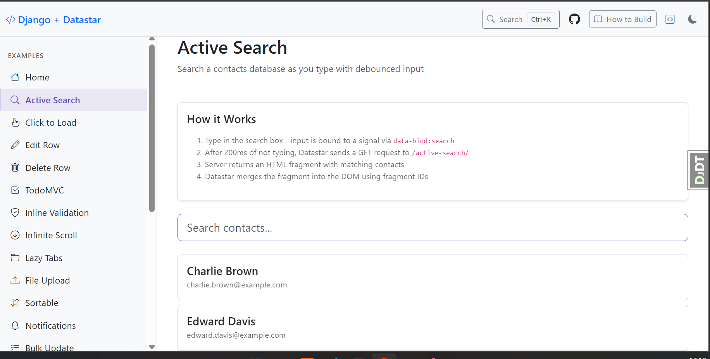
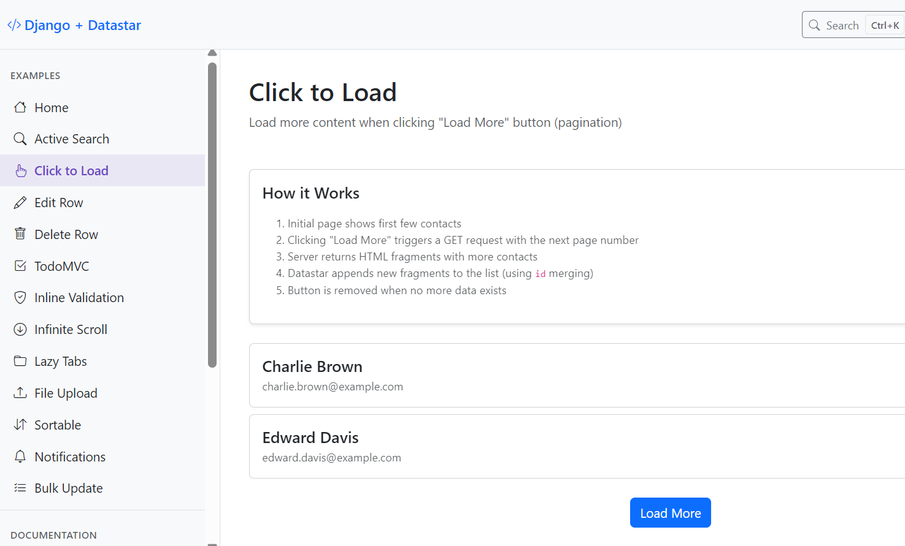
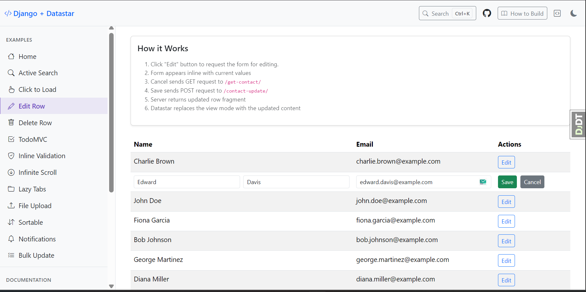
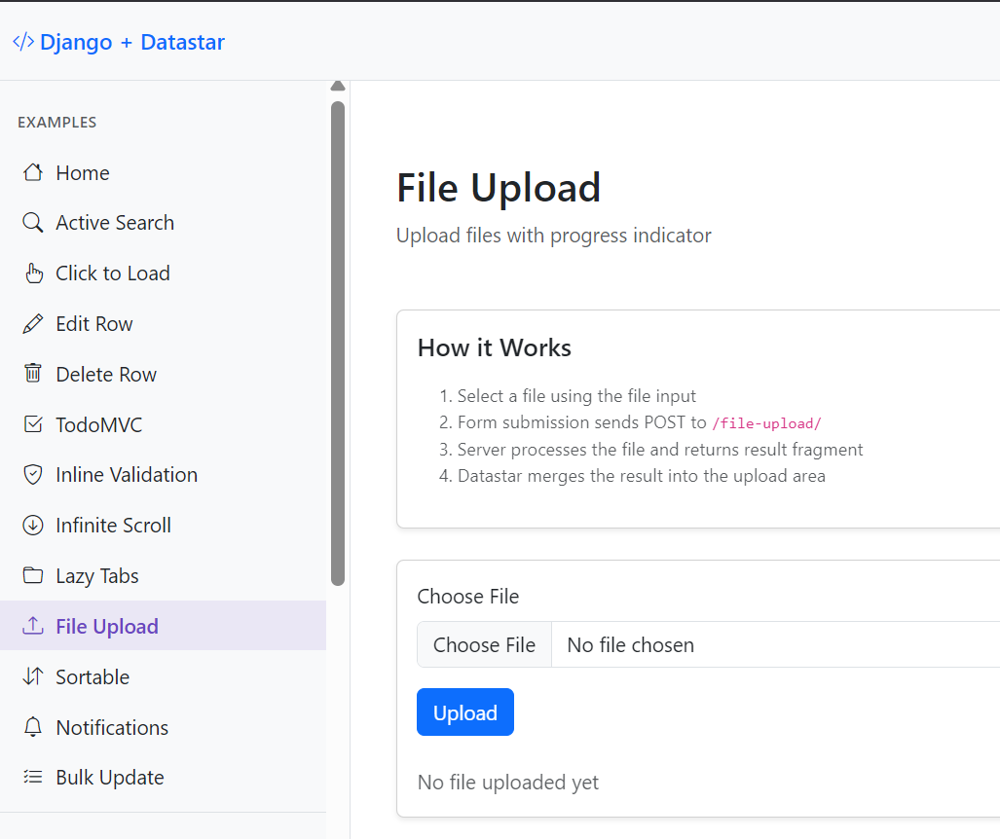
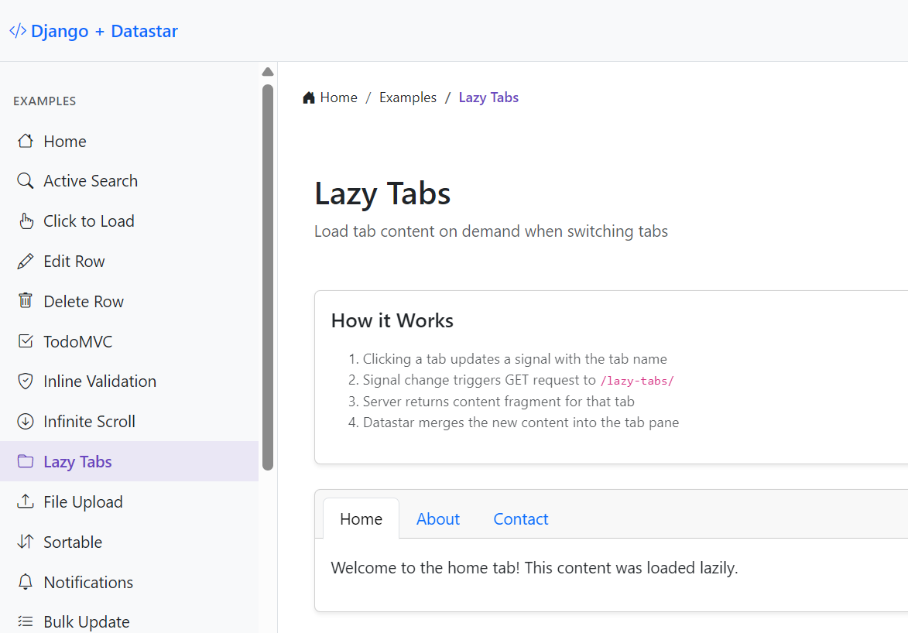
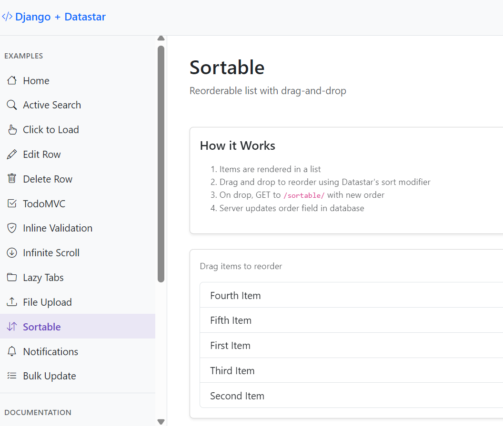

# Django + Datastar Examples

A comprehensive collection of examples demonstrating how to build hypermedia-driven web applications using [Datastar](https://data-star.dev/) with Django.

## What is Datastar?

Datastar is a hypermedia framework that combines the best of [HTMX](https://htmx.org/) (server-side rendering) and [Alpine.js](https://alpinejs.dev/) (client-side reactivity). It enables you to build modern, reactive web applications using a hypermedia approach where the server sends HTML fragments that Datastar merges into the DOM.

Key features:

- **Server-Sent Events (SSE)** for real-time updates
- **Signals** for client-side state management
- **Fragment merging** using idiomorph

## Quick Start

1. **Clone the repository**

2. **Create and activate virtual environment**

   ```bash
   uv venv
   uv sync
   ```

3. **Copy environment variables**

   ```bash
   cp .env_sample .env
   ```

4. **Run migrations**

   ```bash
   uv run python manage.py migrate
   ```

5. **Seed sample data** (optional)

   ```bash
   uv run python manage.py seed_data
   ```

6. **Start the development server**

   ```bash
   uv run python manage.py runserver
   ```

7. **Visit** http://127.0.0.1:8000/

## Examples

This project includes practical examples, each demonstrating a common Datastar pattern

### Screenshots

| Example       | Screenshot                                      |
| ------------- | ----------------------------------------------- |
| Active Search |  |
| Click to Load |  |
| Edit Row      |            |
| File Upload   |      |
| Lazy Tabs     |          |
| Sortable      |            |

## Adding a New Example

1. **Create a model** (if needed) in `examples/models.py`

2. **Add views** in `examples/views.py`:
   - Main view: renders the page with initial state
   - AJAX endpoint: returns Datastar SSE response using `DjangoDatastar`

3. **Create template** in `examples/templates/examples/`

4. **Add URLs** in `examples/urls.py` using kebab-case

5. **Update index** in `examples/templates/examples/index.html`

6. **Run formatters:**

   ```bash
   ruff format .
   djade .
   ```

## Models

The project includes four models for demonstrations:

- **Contact** - For search and CRUD examples
- **Todo** - For TodoMVC example
- **Notification** - For notifications example
- **Item** - For sortable example

## Resources

- [Datastar Documentation](https://data-star.dev/)
- [Datastar Python SDK](https://github.com/starfederation/datastar-python/)

## License

MIT
